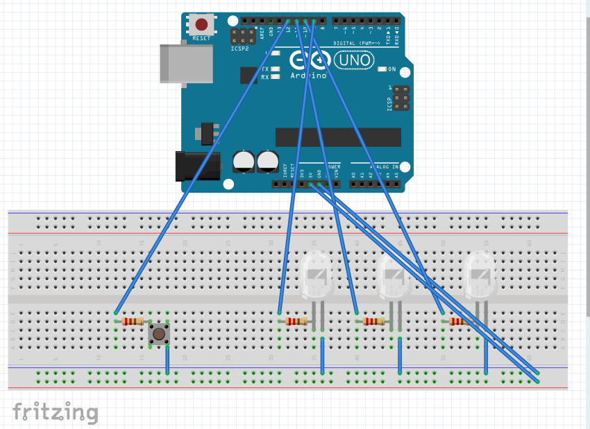

This project demonstrates how to create a stoplight. There are three LEDs (red, yellow and green) and a push button. Red led is turned on by default, then if you push the button, red led will start blinking, yellow turns on for a second and then turns off and green turns on for 3 seconds and go back to red.

Pre-requisites
- Arduino Uno board (or any compatible board)
- 3 LEDs (5 mm)
- 4 resitors (220 Ohms)
- 10 jumper wires (m to m)
- push button
- A-B USB Cable
- 1 breadboard

Install Arduino IDE: https://www.arduino.cc/en/software .
After the installation is complete, create a new sketch (option available at File section or by pressing Ctrl + N). This step will create a .ino file, where the code will be written.
After the code has been written, connect the board to the laptop using the USB cable. This will cause some lights on the board to blink.
Select the board used from the list of boards (Arduino Uno). If the laptop can recognize the board, the connection will also appear under Ports. Select the port and press OK.
If everything worked fine up to this point, the connected board should be visible on the bottom-right part of the screen. Otherwise, the board name and the message 'not connected' will be displayed.
If the board is successfully connected, run the sketch by pressing the Verify button. If the sketch has compiled with no errors, press the Upload button.
